# Batch Mode Executor Refactoring

## Architecture

The core idea: every pipeline phase (taxonomy, parsing, judge) becomes a two-step pattern -- **prepare requests** then **process responses** -- with a pluggable **executor** in between that handles the actual LLM communication.

```mermaid
flowchart LR
    subgraph phase1 [Phase 1: Taxonomy]
        prep1["prepare_taxonomy_requests()"] --> exec1["executor.execute()"] --> proc1["process_taxonomy_responses()"]
    end
    subgraph localCalc [Local: Sampling]
        samp["sample_segments()"]
    end
    subgraph phase3 [Phase 3: Parsing]
        prep3["prepare_parse_requests()"] --> exec3["executor.execute()"] --> proc3["process_parse_responses()"]
    end
    subgraph phase35 [Phase 3.5: Judge]
        prep35["prepare_judge_requests()"] --> exec35["executor.execute()"] --> proc35["process_judge_responses()"]
    end
    proc1 --> samp --> prep3
    proc3 --> prep35
```




Three sequential executor invocations with local processing between them. This respects the data dependency chain: taxonomy results feed into parsing prompts, parsed results feed into judge prompts.

## Executor Abstraction

New sub-package: `src/winerank/sft/executor/`

```
src/winerank/sft/executor/
    __init__.py       # Public API: LLMRequest, LLMResponse, create_executor
    types.py          # LLMRequest, LLMResponse dataclasses
    base.py           # LLMExecutor ABC
    sync.py           # SyncExecutor -- wraps litellm.completion(), one at a time
    batch.py          # BatchExecutor -- provider-native batch APIs
```

### types.py -- Request/Response data structures

```python
@dataclass
class LLMRequest:
    custom_id: str                                    # e.g. "taxonomy__acquerello"
    model: str                                        # litellm model name
    messages: list[dict]                              # OpenAI-format messages
    max_tokens: int = 4096
    temperature: float = 0.0
    response_format: dict | None = None               # e.g. {"type": "json_object"}
    cache_control_injection_points: list[dict] | None = None  # Anthropic caching

@dataclass
class LLMResponse:
    custom_id: str
    content: str                                      # raw response text
    tokens: dict[str, int]                            # {input, output, cached}
    error: str | None = None                          # non-None if the call failed
```

### base.py -- Abstract executor

```python
class LLMExecutor(ABC):
    @abstractmethod
    def execute(self, requests: list[LLMRequest]) -> list[LLMResponse]:
        """Execute all requests and return responses keyed by custom_id."""
        ...
```

### sync.py -- SyncExecutor

Wraps `litellm.completion()`. Processes requests sequentially. Moves the caching logic currently in `wine_parser._call_parsing_model()` into here so it applies to all phases. Logs progress after each call.

### batch.py -- BatchExecutor

Detects provider from model name (`claude` -> Anthropic, otherwise -> OpenAI). Uses the respective native SDK:

- **OpenAI** (`openai` SDK, already installed v2.8.1): create JSONL temp file, upload via `client.files.create()`, submit via `client.batches.create()`, poll `client.batches.retrieve()`, download results via `client.files.content()`
- **Anthropic** (`anthropic` SDK, must be added): submit via `client.messages.batches.create(requests=[...])`, poll `client.messages.batches.retrieve()`, stream results via `client.messages.batches.results()`

Both support prompt caching inside batches (Anthropic explicitly via `cache_control`, OpenAI automatically via prefix matching), so caching and batch discounts stack.

Polling strategy: 30s initial interval, exponential backoff capped at 5 min, configurable total timeout (default 2h).

Batch state persistence: save submitted batch IDs to `data/sft/pending_batch.json` so a crashed process can resume polling on restart instead of resubmitting.

### **init**.py -- Factory

```python
def create_executor(batch_mode: bool = False, data_dir: Path | None = None) -> LLMExecutor:
    if batch_mode:
        return BatchExecutor(data_dir=data_dir)
    return SyncExecutor()
```

## Refactoring Pipeline Modules

Each of the three LLM-calling modules gets split into **prepare** and **process** functions. The private `_call_*_model()` functions are removed entirely -- the executor handles all LLM communication.

### [taxonomy_extractor.py](src/winerank/sft/taxonomy_extractor.py)

- **Remove**: `_call_taxonomy_model()` (lines 27-57)
- **Add**: `prepare_taxonomy_requests(entries, settings, progress, force) -> list[LLMRequest]`
  - Loops entries, skips already-done (progress), extracts full text, builds messages via `build_taxonomy_prompt()`, returns list of `LLMRequest` objects
- **Add**: `process_taxonomy_responses(responses, entries, settings, progress) -> dict[str, TaxonomyResult]`
  - Loops responses, calls existing `_parse_taxonomy_response()`, saves via `save_taxonomy()`, updates progress
- **Keep**: `_parse_taxonomy_response()`, `save_taxonomy()`, `load_taxonomy()`, `load_all_taxonomies()` (unchanged)
- **Deprecate/simplify**: `extract_taxonomy_for_list()` and `extract_taxonomy_for_all()` become thin wrappers that create a SyncExecutor and call prepare+execute+process (for backward compat in tests)

### [wine_parser.py](src/winerank/sft/wine_parser.py)

- **Remove**: `_call_parsing_model()` (lines 36-87), `_is_anthropic_model()` (lines 32-33) -- caching logic moves to SyncExecutor
- **Add**: `prepare_parse_requests(samples, taxonomies, settings, progress, force) -> list[LLMRequest]`
  - Loops samples, skips already-done, re-extracts segment text, builds messages via `build_wine_parsing_messages()`, sets `cache_control_injection_points` for Anthropic models
- **Add**: `process_parse_responses(responses, samples, settings, progress) -> list[PageParseResult]`
  - Loops responses, calls existing `_parse_wines_from_response()`, builds `PageParseResult`, saves, updates progress
- **Keep**: `_parse_wines_from_response()`, `_get_segment_text()`, save/load functions (unchanged)

### [judge_reviewer.py](src/winerank/sft/judge_reviewer.py)

- **Remove**: `_call_judge_model()` (lines 24-46)
- **Add**: `prepare_judge_requests(parse_results, settings, progress, force) -> list[LLMRequest]`
- **Add**: `process_judge_responses(responses, parse_results, settings, progress) -> list[JudgeResult]`
- **Keep**: `_parse_judge_response()`, save/load functions (unchanged)

## Config Changes

[src/winerank/sft/config.py](src/winerank/sft/config.py) -- add two new settings:

```python
batch_mode: bool = Field(
    default=False,
    description="Use provider batch APIs for 50% cost reduction (async, up to 24h turnaround)",
)
batch_timeout: int = Field(
    default=7200,
    description="Max seconds to wait for batch completion (default 2 hours)",
)
```

Env vars: `WINERANK_SFT_BATCH_MODE=true`, `WINERANK_SFT_BATCH_TIMEOUT=7200`

## CLI Changes

[src/winerank/cli.py](src/winerank/cli.py) -- add flags to all relevant commands:

- `--batch / --no-batch` flag (overrides `WINERANK_SFT_BATCH_MODE`)
- `--limit N` flag on `extract-taxonomy`, `sample`, `parse`, `judge`, `run` commands -- limits the number of wine lists processed (entries[:limit]); segments and judge calls are limited transitively

The `sft run` orchestration becomes:

```python
executor = create_executor(batch_mode=settings.batch_mode, data_dir=settings.data_dir_path)

# Phase 1
tax_requests = prepare_taxonomy_requests(entries[:limit], settings, progress, force)
tax_responses = executor.execute(tax_requests)
taxonomies = process_taxonomy_responses(tax_responses, entries, settings, progress)

# Phase 2 (local)
samples = sample_segments(...)

# Phase 3
parse_requests = prepare_parse_requests(samples, taxonomies, settings, progress, force)
parse_responses = executor.execute(parse_requests)
parse_results = process_parse_responses(parse_responses, samples, settings, progress)

# Phase 3.5
if not skip_judge:
    judge_requests = prepare_judge_requests(parse_results, settings, progress, force)
    judge_responses = executor.execute(judge_requests)
    judge_results = process_judge_responses(judge_responses, parse_results, settings, progress)

# Phase 4
build_dataset(settings, progress)
```

## Dependencies

[pyproject.toml](pyproject.toml) -- add `anthropic` as explicit dependency:

```toml
"anthropic>=0.40",
```

`openai` is already installed (v2.8.1) as a transitive dependency of litellm, but should also be made explicit:

```toml
"openai>=1.50",
```

## Cost Impact

For 500 segments with Claude Opus 4.6 (text mode):


| Component                        | Sync cost  | Batch cost | Savings  |
| -------------------------------- | ---------- | ---------- | -------- |
| Taxonomy (41 calls, GPT-4o-mini) | ~$0.50     | ~$0.25     | $0.25    |
| Parsing (500 calls, Opus)        | ~$15-25    | ~$8-13     | ~$8-13   |
| Judge (500 calls, Opus)          | ~$15-25    | ~$8-13     | ~$8-13   |
| **Total**                        | **$31-51** | **$16-26** | **~50%** |


With prompt caching stacking on top of batch discount (Anthropic: 50% batch + 90% cache on repeated prefix), effective savings on cached tokens reach ~95%.

## Test Plan

New test files:

- `tests/test_sft_executor_types.py` -- LLMRequest/LLMResponse construction, serialization
- `tests/test_sft_executor_sync.py` -- SyncExecutor with mocked litellm.completion, verify caching injection, error handling
- `tests/test_sft_executor_batch.py` -- BatchExecutor with mocked openai/anthropic SDKs: batch creation, polling, result collection, timeout, resume from pending batch
- `tests/test_sft_prepare_process.py` -- Test the prepare/process functions for all three phases: verify correct LLMRequest construction, verify correct response processing

Update existing tests:

- `tests/test_sft_taxonomy_extractor.py` -- adapt to new prepare/process API
- `tests/test_sft_wine_parser.py` -- adapt to new prepare/process API
- `tests/test_sft_judge_reviewer.py` -- adapt to new prepare/process API
- `tests/test_sft_cli.py` -- add tests for --batch and --limit flags
- `tests/test_sft_config.py` -- add tests for batch_mode and batch_timeout settings

