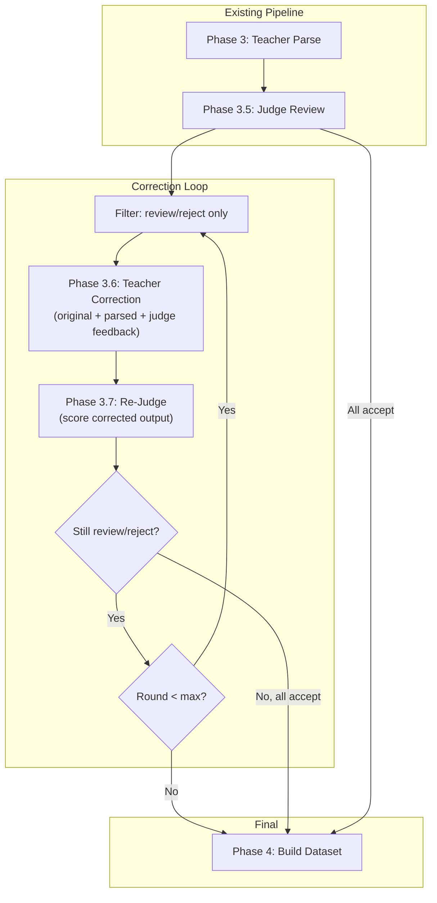

# Judge Feedback Correction Loop

## Motivation

Currently the pipeline is open-loop: Teacher parses -> Judge scores -> segments with low scores are filtered out of the training set. The Judge's actionable feedback (missing wines, wrong attributes, hallucinations) is never used to fix the Teacher's output. This wastes 20-40% of parsed segments that could become good training samples after correction.

## Architecture

The correction loop adds Phases 3.6/3.7 between the Judge pass and dataset build. Only segments flagged by the Judge ("review" or "reject") enter the correction loop. The Teacher receives its original output plus the Judge's structured feedback and re-parses. The Judge then re-evaluates the corrected output. This repeats up to `max_correction_rounds` times.




## Key Changes

### 1. Redesign Judge Output Schema

Extend [src/winerank/sft/schemas.py](src/winerank/sft/schemas.py) -- `JudgeResult` gets a new `corrections` field with structured issue types:

```python
class JudgeIssue(BaseModel):
    type: Literal["missing_wine", "hallucinated_wine", "wrong_attribute", "wrong_price", "other"]
    description: str
    wine_name: str | None = None
    field: str | None = None
    current_value: str | None = None
    expected_value: str | None = None

class JudgeResult(BaseModel):
    # ... existing fields ...
    issues: list[JudgeIssue] = Field(default_factory=list)  # CHANGED from list[str]
    needs_reparse: bool = Field(default=False)
    correction_round: int = Field(default=0)
```

The `issues` field changes from `list[str]` to `list[JudgeIssue]`. This is a breaking change to the Judge output schema that requires updating the Judge prompt and the `_parse_judge_response()` function. Existing judged results on disk will need a migration path (fall back to treating string issues as `{"type": "other", "description": str}`).

### 2. Update Judge Prompt

Update `JUDGE_USER_PROMPT` in [src/winerank/sft/prompts.py](src/winerank/sft/prompts.py) to request structured corrections:

```json
{
  "score": 0.65,
  "wine_count_match": false,
  "issues": [
    {"type": "missing_wine", "description": "Wine 'Chateau Margaux 2015' at $450 not extracted", "wine_name": "Chateau Margaux 2015"},
    {"type": "wrong_attribute", "wine_name": "Opus One", "field": "price", "current_value": "850", "expected_value": "85"},
    {"type": "hallucinated_wine", "wine_name": "Non-existent Wine XYZ"}
  ],
  "needs_reparse": true,
  "recommendation": "review"
}
```

### 3. New Correction Prompt

Add `CORRECTION_SYSTEM_PROMPT` and `CORRECTION_USER_PROMPT` to [src/winerank/sft/prompts.py](src/winerank/sft/prompts.py). The correction prompt sends the Teacher:

- The system schema (same as original parse -- cacheable)
- The taxonomy (same as original parse -- cacheable) 
- The original segment text
- The Teacher's previous parsed JSON output
- The Judge's structured issues list
- Instruction: "Re-parse the segment, fixing the identified issues while keeping correct extractions intact"

The prompt structure preserves cacheability: system message and taxonomy block are identical to the parsing prompt, so cached tokens still apply.

### 4. New Module: `src/winerank/sft/corrector.py`

New module following the existing `prepare/process` pattern:

- `prepare_correction_requests(parse_results, judge_results, taxonomies, settings, progress, round_num) -> list[LLMRequest]`
  - Filters to segments where `judge.recommendation in ("review", "reject")` or `judge.needs_reparse`
  - Builds correction prompts with original text + previous output + judge feedback
  - Uses same cache_control_injection_points as wine_parser (system + taxonomy cacheable)
- `process_correction_responses(responses, samples_by_id, settings, progress, round_num) -> list[PageParseResult]`
  - Parses corrected wines from responses
  - **Overwrites** the original parsed result in `data/sft/parsed/` with the corrected version
  - Tracks correction round number in the result

### 5. Config Changes

Add to [src/winerank/sft/config.py](src/winerank/sft/config.py):

```python
max_correction_rounds: int = Field(
    default=2,
    description="Maximum Teacher correction rounds using Judge feedback (0 to disable)",
)
```

Env var: `WINERANK_SFT_MAX_CORRECTION_ROUNDS=2`

### 6. Progress Tracking

Add a `correction` section to [src/winerank/sft/progress.py](src/winerank/sft/progress.py):

```python
_KEY_CORRECTION = "correction"

# Track: is_correction_done(list_id, seg_idx, round_num)
# Track: mark_correction_done(list_id, seg_idx, round_num, ...)
```

This keeps correction progress separate from the initial parse/judge progress, enabling clean resumability.

### 7. CLI Orchestration

Update `sft run` in [src/winerank/cli.py](src/winerank/cli.py) to add the correction loop after the Judge phase:

```python
# Phase 3.5: Judge
judge_results = ...

# Phase 3.6-3.7: Correction loop
for round_num in range(1, settings.max_correction_rounds + 1):
    flagged = [j for j in judge_results.values()
               if j.recommendation in ("review", "reject")]
    if not flagged:
        break
    console.print(f"Phase 3.{5 + round_num}: Correction round {round_num} "
                  f"({len(flagged)} segments)...")
    
    corr_requests = prepare_correction_requests(
        parse_results, flagged, taxonomies, settings, progress, round_num)
    corr_responses = executor.execute(corr_requests)
    corrected = process_correction_responses(
        corr_responses, samples_by_id, settings, progress, round_num)
    
    # Re-judge corrected segments
    rejudge_requests = prepare_judge_requests(corrected, settings, progress, force=True)
    rejudge_responses = executor.execute(rejudge_requests)
    new_judge = process_judge_responses(rejudge_responses, settings, progress)
    judge_results.update({j.segment_id: j for j in new_judge})

# Phase 4: Build dataset (now includes corrected segments)
```

Add `--max-correction-rounds` CLI flag (default from settings) and `--skip-correction` flag.

### 8. New CLI Command

Add `winerank sft correct` command for running the correction loop independently (after judge results exist).

### 9. PageParseResult Extension

Add optional field to [src/winerank/sft/schemas.py](src/winerank/sft/schemas.py) `PageParseResult`:

```python
correction_round: int = Field(default=0, description="0=original, 1+=which correction round produced this")
```

### 10. DB Manager GUI Update

Update [src/winerank/db_manager/pages/sft_review.py](src/winerank/db_manager/pages/sft_review.py) to show:

- Correction round indicator (badge showing "Original" vs "Corrected R1" / "Corrected R2")
- Before/after comparison: toggle between original and corrected parse results
- Judge issues displayed as structured cards (type-colored: red for missing_wine, orange for wrong_attribute, etc.)

### 11. Backward Compatibility

- Existing `data/sft/judged/*.json` files with string-based issues: the `_parse_judge_response()` function should detect the old format and convert string issues to `JudgeIssue(type="other", description=str)`.
- The correction loop is entirely opt-in: `max_correction_rounds=0` disables it, and `--skip-correction` skips it in `sft run`.
- The `build_dataset` function doesn't need changes -- it reads from `parsed/` directory which now contains corrected results (overwritten in place).

### 12. Tests

- `tests/test_sft_corrector.py`: Test prepare/process for correction requests, verify prompt includes judge feedback, verify parsed results are overwritten
- `tests/test_sft_judge_reviewer.py`: Update for structured `JudgeIssue` schema, test backward compat with string issues
- `tests/test_sft_schemas.py`: Add tests for `JudgeIssue`, updated `JudgeResult`, `correction_round` field
- `tests/test_sft_prompts.py`: Test correction prompt templates
- `tests/test_sft_cli.py`: Test `--max-correction-rounds` and `--skip-correction` flags
- `tests/test_sft_progress.py`: Test correction round tracking

### Cost Impact

For 500 segments assuming 30% flagged (150 segments), 2 correction rounds with batch pricing:

- Round 1: ~150 correction + ~150 re-judge calls = ~$6-10
- Round 2: ~50 correction + ~50 re-judge calls = ~$2-4
- Total additional cost: ~$8-14
- Expected recovery: 80-120 additional training samples that would otherwise be lost

