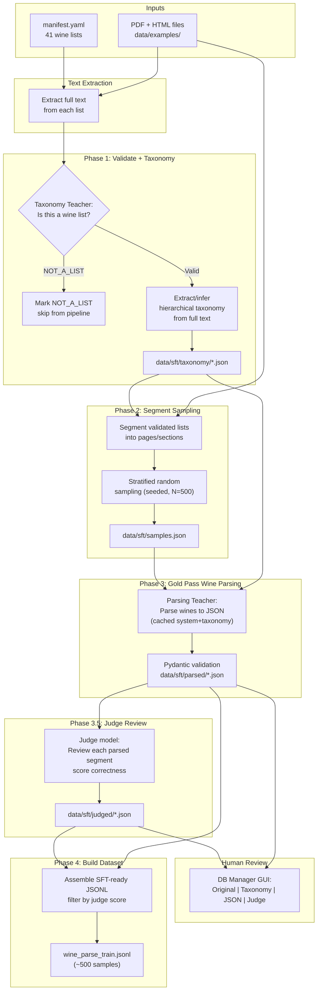

# SFT Training Data Generation Pipeline (Revised v5)

## Core Architecture

Three-phase Teacher model approach with optional Judge review:

1. **Taxonomy Teacher** (cheap: GPT-4o-mini / Gemini Flash, ~$0.50-0.70 for all 41 lists): Scans FULL extracted text of each wine list. First validates it IS a wine list (NOT_A_LIST gate). If valid, extracts or infers a hierarchical wine category taxonomy.
2. **Wine Parsing Teacher** (powerful: Claude Opus / GPT-4o): Parses sampled segments into gold-standard wine JSON, with taxonomy injected as VALID CATEGORIES. Prompt caching enabled to reduce cost on repeated system+taxonomy context.
3. **Judge Model** (optional, powerful LLM): Reviews each parsed segment and scores correctness. Flags samples with issues for human review. This is an additional cost but improves dataset quality.
4. **Human Review** via DB Manager GUI: Streamlit page showing original segment (rendered PDF page or HTML), extracted taxonomy, parsed wine JSON, and **Judge review results** (scores, recommendations, flagged issues) side-by-side.

The taxonomy step is an **orchestration step** used both during training data generation AND at production inference time. It is NOT a training target.

## Pipeline Flow




## File Structure

```
src/winerank/sft/
    __init__.py
    config.py              # SFT settings: teacher models, judge model, paths, caching
    schemas.py             # Pydantic: WineSample, PageParseResult, TaxonomyResult, JudgeResult
    prompts.py             # All prompt templates (validation+taxonomy, wine parsing, judge)
    manifest.py            # Wine list manifest: load/validate YAML
    page_reader.py         # Full-text extraction, per-page extraction, HTML segmentation
    taxonomy_extractor.py  # Validate + taxonomy via cheap Teacher (full text scan)
    page_sampler.py        # Stratified random page/segment sampling
    wine_parser.py         # Wine parsing via powerful Teacher + taxonomy context + caching
    judge_reviewer.py      # Optional judge pass: LLM reviews parsed results for correctness
    dataset_builder.py     # Assemble final SFT-ready JSONL training files
    progress.py            # Progress tracking + resume support

src/winerank/db_manager/pages/
    sft_review.py          # NEW: Streamlit page for SFT training data review + Judge results

tests/
    test_sft_config.py
    test_sft_schemas.py
    test_sft_prompts.py
    test_sft_manifest.py
    test_sft_page_reader.py
    test_sft_taxonomy_extractor.py
    test_sft_page_sampler.py
    test_sft_wine_parser.py
    test_sft_judge_reviewer.py
    test_sft_dataset_builder.py
    test_sft_progress.py
    test_sft_cli.py

data/sft/
    manifest.yaml          # Wine list registry (all files in data/examples/)
    taxonomy/              # Taxonomy results per list (JSON), incl. NOT_A_LIST markers
    samples.json           # Selected segment references
    parsed/                # Per-segment wine parsing results (JSON)
    judged/                # Per-segment judge review results (JSON, optional)
    dataset/               # Final JSONL training file(s) -- self-contained, can be copied/moved
    progress.json          # Pipeline state for resumability
```

## Key Design Decisions

### 1. Two Teacher Models + Optional Judge (Separate Config)

All configured via `.env` file (pydantic-settings already reads from `.env`):

```env
WINERANK_SFT_TAXONOMY_MODEL=gpt-4o-mini
WINERANK_SFT_TEACHER_MODEL=claude-4-opus-20250115
WINERANK_SFT_JUDGE_MODEL=claude-4-opus-20250115
WINERANK_SFT_TRAINING_DATA_MODE=vision
WINERANK_SFT_NUM_SAMPLES=500
WINERANK_SFT_SEED=42
```

- **Taxonomy Teacher** (`WINERANK_SFT_TAXONOMY_MODEL`): Cheap model. Default: `gpt-4o-mini`. Scans full text, ~41 calls.
- **Wine Parsing Teacher** (`WINERANK_SFT_TEACHER_MODEL`): Powerful model. Default: `claude-4-opus-20250115`. ~500 calls.
- **Judge Model** (`WINERANK_SFT_JUDGE_MODEL`): Powerful model for review pass. Default: same as teacher.
- **Mode** (`WINERANK_SFT_TRAINING_DATA_MODE`): `vision` or `text`.

All use `litellm` for provider-agnostic calls.

### 2. Wine List Validation Gate (NOT_A_LIST)

The taxonomy Teacher checks in a single call per list whether the text is a wine list with multiple distinct wines and prices. If not, returns `{"status": "NOT_A_LIST"}`. The file is excluded from sampling, parsing, and dataset assembly.

```python
class TaxonomyNode(BaseModel):
    name: str
    subcategories: list[TaxonomyNode] = []

class TaxonomyResult(BaseModel):
    status: Literal["OK", "NOT_A_LIST"]
    restaurant_name: str | None = None
    categories: list[TaxonomyNode] = []
```

### 3. Full-Text Taxonomy Scan

The taxonomy Teacher receives the entire extracted text (not first N pages). This allows it to find an existing TOC and enrich it, or infer a taxonomy from section headers and wine groupings when no TOC exists. Cost: all 41 lists at ~3.9M tokens = $0.50-0.70 with GPT-4o-mini.

### 4. Prompt Caching Strategy

The wine parsing prompt is structured to maximize cache hits:

- **System message** (schema + rules): identical across ALL calls -- cacheable
- **User message block 1** (taxonomy): identical for all segments of the SAME list -- cacheable
- **User message block 2** (segment text): varies per call

**Anthropic:** Enabled via litellm's `cache_control_injection_points`. Cached input tokens are 90% cheaper.

**OpenAI:** Automatic for prompts with 1024+ tokens where the prefix matches. No explicit opt-in needed.

### 5. Wine Parsing Prompt

System prompt enforces precision ("Be extremely accurate... do NOT fabricate missing information unless absolutely obvious"), uses non-limited values for `wine_type` and `appellation`, and corrects taxonomy attribution to describe it as extracted from both the TOC and structural analysis of the document. Full prompt detailed in [prompts.py](src/winerank/sft/prompts.py).

### 6. Judge Review Pass (Phase 3.5)

An optional step where a powerful LLM reviews each parsed segment for correctness. Returns a structured assessment:

```python
class JudgeResult(BaseModel):
    segment_id: str
    score: float          # 0.0 to 1.0 overall correctness
    wine_count_match: bool
    issues: list[str]
    recommendation: Literal["accept", "review", "reject"]
```

Flags missing wines, hallucinated wines, incorrect attribute mappings, and formatting issues. The `build` step can filter by judge score.

### 7. SFT-Ready Dataset Format

Single output file: `data/sft/dataset/wine_parse_train.jsonl` in **OpenAI chat-completion JSONL** format (compatible with OpenAI Fine-Tuning API, HuggingFace TRL, Axolotl, LLaMA-Factory, Unsloth). Each line is a complete `{"messages": [...]}` training example. A `metadata.json` accompanies the JSONL with full provenance.

### 8. DB Manager GUI: SFT Training Data Review with Judge Results

New Streamlit page at [src/winerank/db_manager/pages/sft_review.py](src/winerank/db_manager/pages/sft_review.py), registered in [src/winerank/db_manager/app.py](src/winerank/db_manager/app.py).

**Four-panel layout (3 columns + judge detail section):**

```
+---------------------------+---------------------------+---------------------------+
|   ORIGINAL SEGMENT        |   TAXONOMY                |   PARSED WINES (JSON)     |
|                           |                           |                           |
| PDF: rendered page image  | Hierarchical tree view    | Formatted JSON with       |
| HTML: rendered HTML chunk | of VALID CATEGORIES       | expandable wine entries    |
|                           |                           |                           |
| Extracted text below      | Flat list view toggle     | Wine count summary        |
| the visual render         |                           |                           |
+---------------------------+---------------------------+---------------------------+
| JUDGE REVIEW RESULTS (full width, collapsed by default)                           |
|                                                                                   |
| Score: 0.95  |  Recommendation: ACCEPT  |  Wine Count Match: Yes                |
| Issues: (none)                                                                    |
|                                                                                   |
| [Detailed breakdown table: wine-by-wine assessment if available]                  |
+-----------------------------------------------------------------------------------+
```

**Judge-specific features in the GUI:**

- **Score badge**: Color-coded indicator (green >= 0.8, yellow >= 0.5, red < 0.5)
- **Recommendation pill**: "accept" / "review" / "reject" with distinct colors
- **Issues list**: Expandable list of specific problems flagged by the judge
- **Filtering by judge results**: Sidebar filters to show only segments with specific recommendations (e.g., "show only review/reject for human attention")
- **Aggregate stats**: Summary sidebar showing total accept/review/reject counts, average score, score distribution histogram
- **Graceful fallback**: When judge pass was not run, the judge section is hidden and all segments are shown as "not reviewed"
- **Human override capability** (future): Allow reviewers to override judge recommendations and mark segments as "human-verified"

This page reads directly from `data/sft/` directories (taxonomy/, parsed/, judged/) -- no database required.

### 9. CLI Commands

```
winerank sft init              # Generate manifest.yaml from data/examples/
winerank sft extract-taxonomy  # Phase 1: Validate + extract taxonomy for all lists
winerank sft sample            # Phase 2: Sample segments for training
winerank sft parse             # Phase 3: Run Wine Parsing Teacher on sampled segments
winerank sft judge             # Phase 3.5: Run Judge model on parsed results (optional)
winerank sft build             # Phase 4: Assemble final JSONL dataset
winerank sft run               # All phases end-to-end (optionally including judge)
winerank sft stats             # Dataset statistics, cost summary, NOT_A_LIST report
```

Common flags: `--taxonomy-model`, `--teacher-model`, `--judge-model`, `--mode vision|text`, `--seed`, `--num-samples`, `--min-judge-score`, `--dry-run`, `--force`, `--skip-judge`.

### 10. Sampling Strategy

Stratified random sampling across validated wine lists (not marked NOT_A_LIST). Target: 500 samples. Proportional to segment count per list. Minimum 2 segments per list. Maximum cap to prevent dominance. Skip blank/near-empty segments (< 50 chars). Reproducible via `--seed`.

### 11. Progress Tracking and Resumability

`data/sft/progress.json` tracks taxonomy, parse, and judge completion status, token usage, costs, errors, and retries. Pipeline skips completed work on re-run. `--force` to redo.

### 12. Dataset Backup and Reuse

`data/sft/dataset/` is self-contained (`wine_parse_train.jsonl` + `metadata.json`). Back up by copying the directory. No special commands needed.

### 13. Test Plan

All tests go in the existing `tests/` directory, following the project's established patterns (pytest, fixtures in `conftest.py`, `unittest.mock` for external calls, `tmp_path` for file I/O). Tests are organized as one file per SFT module.

**[tests/test_sft_config.py](tests/test_sft_config.py)** -- SFT configuration:

- Loading defaults when no .env vars set
- Override via environment variables for all 6 settings (taxonomy_model, teacher_model, judge_model, mode, num_samples, seed)
- Validation of mode enum (vision/text)
- Invalid values raise appropriate errors

**[tests/test_sft_schemas.py](tests/test_sft_schemas.py)** -- Pydantic models:

- `TaxonomyNode` nesting/serialization
- `TaxonomyResult` with OK status and categories
- `TaxonomyResult` with NOT_A_LIST status (empty categories)
- `JudgeResult` validation (score bounds 0-1, recommendation enum)
- `WineSample` / `PageParseResult` round-trip serialization
- Reject invalid data (missing required fields, out-of-range scores)

**[tests/test_sft_prompts.py](tests/test_sft_prompts.py)** -- Prompt templates:

- Taxonomy prompt includes full text and instructions
- Wine parsing system prompt includes all schema attributes and rules
- Wine parsing user prompt injects taxonomy flat list and segment text
- Judge prompt includes original text, taxonomy, and parsed JSON
- Verify prompt structure suitable for caching (system message separate from user)

**[tests/test_sft_manifest.py](tests/test_sft_manifest.py)** -- Manifest handling:

- Load valid YAML manifest with expected fields
- Generate manifest from data/examples/ directory (list discovered files)
- Handle missing files gracefully
- Validate required fields (file_path, restaurant_name, file_type)

**[tests/test_sft_page_reader.py](tests/test_sft_page_reader.py)** -- Page/segment extraction:

- PDF full-text extraction (using real example PDFs, skip if unavailable)
- PDF per-page text extraction
- PDF page-to-image conversion (requires pdf2image)
- HTML full-text extraction
- HTML segmentation: heading-based splitter on HTML with h1/h2/h3 tags
- HTML segmentation: text-pattern fallback on flat HTML (ALL CAPS detection)
- Empty/near-blank segment filtering (< 50 chars)
- Nonexistent file raises FileNotFoundError

**[tests/test_sft_taxonomy_extractor.py](tests/test_sft_taxonomy_extractor.py)** -- Taxonomy extraction (LLM calls mocked):

- Mock litellm.completion to return a valid taxonomy JSON; verify parsed `TaxonomyResult`
- Mock litellm.completion to return NOT_A_LIST; verify status and empty categories
- Verify the full text is included in the prompt sent to the model
- Verify the correct model name from config is used
- Handle LLM errors gracefully (retry logic, error recording in progress)
- Save taxonomy result to data/sft/taxonomy/ as JSON

**[tests/test_sft_page_sampler.py](tests/test_sft_page_sampler.py)** -- Sampling logic:

- Reproducibility: same seed produces identical sample set
- Stratified proportional allocation across lists
- Minimum 2 segments per list enforced
- NOT_A_LIST files are excluded from sampling
- Blank segments (< 50 chars) are skipped
- Total sample count respects `num_samples` target
- Different seeds produce different sample sets

**[tests/test_sft_wine_parser.py](tests/test_sft_wine_parser.py)** -- Wine parsing (LLM calls mocked):

- Mock litellm.completion to return valid wine JSON; verify Pydantic validation passes
- Verify taxonomy is injected as VALID CATEGORIES in user message
- Verify system prompt contains schema and rules
- Verify cache_control_injection_points are set for Anthropic models
- Handle malformed LLM responses (JSON parse error, missing fields)
- Vision mode: verify image content block is included in messages
- Text mode: verify only text content blocks
- Results saved to data/sft/parsed/ as JSON

**[tests/test_sft_judge_reviewer.py](tests/test_sft_judge_reviewer.py)** -- Judge review (LLM calls mocked):

- Mock litellm.completion to return a valid JudgeResult JSON
- Verify original text, taxonomy, and parsed JSON are all included in judge prompt
- Score validation (0.0-1.0 range)
- Recommendation values: accept, review, reject
- Handle judge errors gracefully
- Results saved to data/sft/judged/ as JSON

**[tests/test_sft_dataset_builder.py](tests/test_sft_dataset_builder.py)** -- JSONL assembly:

- Build JSONL from parsed results (no judge filtering)
- Build JSONL with judge filtering (min_judge_score threshold)
- Verify JSONL format: each line is valid JSON with "messages" key
- Verify messages structure: system, user, assistant roles in correct order
- System message contains schema, user contains taxonomy + text, assistant contains wine JSON
- metadata.json is generated with correct fields (timestamp, models, counts, config)
- Empty dataset (all filtered out) produces empty file + metadata with 0 count

**[tests/test_sft_progress.py](tests/test_sft_progress.py)** -- Progress tracking:

- Save and load progress state from JSON
- Mark taxonomy/parse/judge steps as completed
- Skip already-completed items on re-check
- Force flag resets completed status
- Track token usage and cost per call
- Handle corrupted/missing progress.json gracefully

**[tests/test_sft_cli.py](tests/test_sft_cli.py)** -- CLI integration:

- `sft init` creates manifest.yaml (using CliRunner from typer.testing)
- `sft extract-taxonomy --dry-run` shows what would happen without LLM calls
- `sft sample` with known seed produces deterministic output
- `sft stats` prints summary table
- `sft run --skip-judge` skips judge phase
- Invalid flags produce helpful error messages
- Common flags (--seed, --num-samples, --mode) are correctly passed to pipeline

### 14. Cost Summary

- Taxonomy extraction (GPT-4o-mini, 41 calls): $0.50-0.70
- Wine parsing vision (Claude Opus, ~500 calls): $50-75
- Wine parsing text (Claude Opus, ~500 calls): $15-25
- Judge review optional (Claude Opus, ~500 calls): $15-25
- **Total w/ judge (vision)**: $66-101
- **Total w/ judge (text)**: $31-51
- **Total no judge (vision)**: $51-76
- **Total no judge (text)**: $16-26

Prompt caching reduces wine parsing cost significantly (90% cheaper cached tokens for Anthropic, 50% for OpenAI).